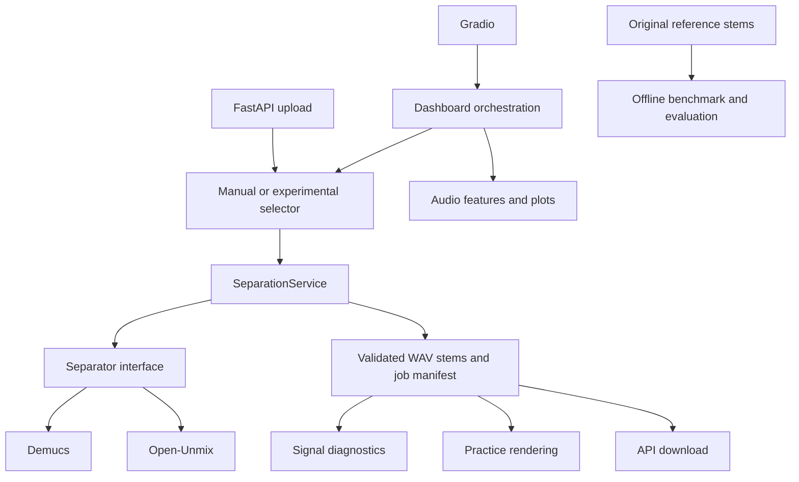

# Architecture and execution contracts

Gradio composes analysis, separation, practice, comparison and dashboard services.
FastAPI exposes the core separation service independently, using the same adapters
and validation. It currently provides separation/download endpoints; the research
and practice workflows remain in Gradio and the CLI.

Settings come from defaults, then optional JSON, then environment overrides.
Relative paths resolve against the working directory. The app fails early on
unknown configuration keys and nonpositive limits. Application logs are JSON on
stderr; server access logs retain Uvicorn's own format.

Each process owns two lazy adapters. Their locks protect loaded model reuse;
checkpoints are cached on disk by PyTorch under TORCH_HOME. No separation-result
cache is used: every request creates a fresh job, avoiding stale results after
model or parameter changes. Gradio uses its shared processing queue. The API
allows one active separation and returns 409 to overlapping requests. Run one API
worker; separate UI/API processes have separate model memory and concurrency gates.

The API captures uploads under the controlled output directory, checks byte and
duration limits, and deletes captured uploads after success or failure. Multipart
parsing happens before the route, so the byte limit is not an ingress/server limit.
Completed job audio is retained for download across restarts. IDs and stem names
are constrained; downloads reject symlinked job directories and audio files.
No endpoint accepts arbitrary local input or download paths. Optional Supabase
authentication adds per-user API directories and isolated Gradio workspaces; see
[supabase-auth.md](supabase-auth.md). With no auth configuration this remains a
local, unauthenticated API. Public hosting requires a separate deployment design.

There is no automatic retention deletion: dashboard/comparison evidence links
separation jobs. Back up or delete related job groups together when no longer
needed. Dataset, model and output directories are excluded from source and Docker
contexts. The container stores generated output and checkpoints in /storage.

Tests inject lightweight separators to exercise service contracts, error recovery,
HTTP downloads, concurrent requests and path containment without model downloads.
Real pretrained-model smoke checks supplement these tests. Test counts measure
software checks, not audio separation accuracy. Scientific limitations and actual
held-out selector results are recorded in the README and experiment manifests.
